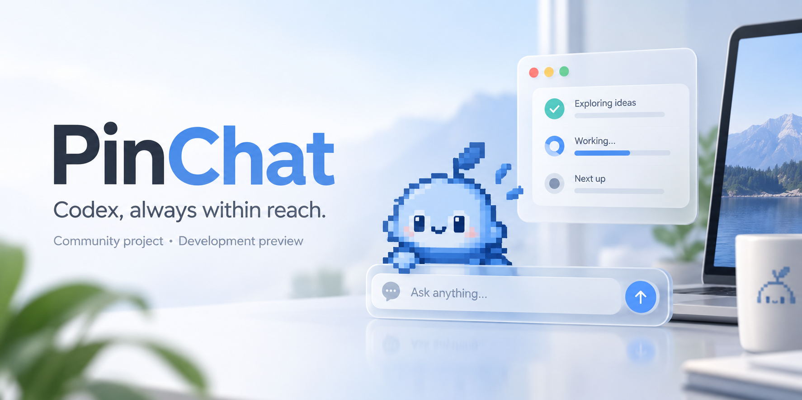

# PinChat — macOS Codex 置顶小窗与桌面助手

> Native macOS floating window, quick chat, desktop pet and task monitor for Codex.

[](https://www.apple.com/macos/)
[](https://www.swift.org/)
[](https://github.com/foolyuyu/PinChat/actions/workflows/ci.yml)
[](LICENSE)


[简体中文](README.md) · [English](README.en.md)

PinChat 是一个面向 **Codex Desktop / ChatGPT macOS** 的原生置顶小窗与桌宠伴随组件。它让你不必频繁切换窗口，就能快速提问、查看简单回答、跟踪 Codex 任务状态，并在需要时回到原始 Codex 任务继续工作。

它不是另一套 AI 服务：PinChat 通过本机 Codex App Server 工作，使用用户已有的 Free、Plus、Pro 或工作区登录与额度，不要求 OpenAI API Key，并跟随本机 Codex 的模型、推理强度、人格和权限配置。



> [!IMPORTANT]
> PinChat 目前是开发预览版，交互和数据格式仍可能调整。当前本机构建使用 ad-hoc 签名，尚未提供经过 Apple Developer ID 签名与公证的公开安装包。公开宣传前会继续完成分发签名、安装体验和兼容性验证。

## 为什么做 PinChat

- **少切一次窗口**：在当前桌面直接提问和阅读简短回答。
- **不错过任务完成**：桌宠同步展示 Codex 任务的思考、等待、完成与失败状态。
- **仍然属于 Codex**：复杂工作继续在 Codex 主应用中完成，不建立第二套账号、人格或历史系统。
- **原生 macOS 体验**：置顶、全屏 Space、拖放附件、标准编辑快捷键和系统玻璃材质。

## 项目状态与信任入口

| 项目 | 当前状态 |
| --- | --- |
| 稳定性 | 开发预览；适合测试和反馈，不承诺生产级稳定性 |
| 账号与额度 | 由本机 Codex / ChatGPT 管理；PinChat 不保存密码或 API Key |
| 遥测 | PinChat 当前不包含自建分析、广告或崩溃上报服务 |
| 本地数据 | 会话显示副本、窗口偏好、附件缓存和桌宠素材缓存 |
| 直接网络访问 | 仅在本机无可用桌宠素材时，从 OpenAI 静态资源域名下载后备图集 |
| 分发 | 当前需从源码构建或使用本机测试包；正式签名与公证待完成 |
| 官方关系 | 社区项目，与 OpenAI 无隶属或官方认可关系 |

详细说明：

- [隐私与数据说明](docs/PRIVACY.md)
- [安全策略](SECURITY.md)
- [架构与信任边界](docs/ARCHITECTURE.md)
- [后续路线图](ROADMAP.md)
- [参与贡献](CONTRIBUTING.md)
- [GitHub 发布与可搜索性清单](docs/PUBLISHING.md)

## 快速开始

系统要求：macOS 14 或更高版本，以及 ChatGPT 桌面应用或可用的 Codex CLI。

```sh
git clone git@github.com:foolyuyu/PinChat.git
cd PinChat
swift test
./scripts/build-app.sh
open Release/PinChat.app
```

默认快捷键为 `⌥⇧Space`。也可以点击桌宠展开输入框，悬停桌宠查看近期 Codex 任务。

如果只是关注项目进展，可以先点击 GitHub 的 **Watch → Releases only**；如果 PinChat 对你有帮助，欢迎 Star、提交 Issue 或参与测试。

## 核心体验

- 高保真蓝色 Codex 桌宠，支持待机、工作、完成、失败和拖动动画，并过滤图集中的透明空帧
- 输入条或回答窗口中出现键入光标时，桌宠使用官方 16 向姿态看向文字插入点；文字增长、换行或移动插入点时同步调整
- 输入框失焦或关闭后恢复基础姿态；拖动、失败等明确状态仍优先显示自身动画，“减少动态效果”开启时自动降低采样频率
- 桌宠按官方实机参考保持约 52 pt，透明承载区进一步缩至 64×64 pt，不再保留下方铅笔入口
- 点击桌宠本体直接展开横向输入条；再次点击桌宠、按 `Esc` 或再次使用快捷键均可收起
- 输入条展开后点击桌面或其他应用会自动收回；退场时从左右两端向自身中心压缩并淡出，附件菜单、系统文件选择器以及从 Finder 连续拖入文件都不会误触发
- 输入条和回答追问框支持 macOS 标准 `⌘A / ⌘C / ⌘V / ⌘X / ⌘Z / ⇧⌘Z` 编辑快捷键
- 可将 Finder 文件、文件夹、截图缩略图或其他应用提供的图片直接拖入紧凑输入条和回答追问区；拖入时显示轻量高亮，并共用去重后的附件队列
- 输入条 `+` 支持添加多个文件/文件夹、照片和交互式截屏；附件可在发送前单独移除
- 输入条不再放置独立权限按钮；PinChat 每次提问前读取 Codex 主应用的本机权限选择，自动跟随“询问批准 / 自动审查 / 完全访问 / 只读 / 自定义权限”
- 当 Codex 当前设置确实要求审批时，小窗仍会显示真实命令、原因与路径，并支持拒绝、允许一次或本次对话允许
- `+` 还会读取本机 Codex 的真实技能与已连接应用，选择后通过官方 `skill` / `mention` 输入项调用
- 图片作为 Codex 原生本地图片输入发送，普通文件和文件夹作为用户选择的只读本机路径上下文发送
- 输入框与状态卡取消外围透明承载边并使用不透底系统表面，不再透出下方页面文字
- 鼠标在桌宠上短暂停留后，以同一列表显示最多 5 个近期 Codex 桌面任务和 PinChat 小输入框任务；工作中任务优先，每项独立显示“正在思考 / 等待操作 / 已完成 / 已停止 / 失败”
- 整行任务卡可点击并以轻量悬停反馈提示将打开对应 Codex 任务；重复的右侧跳转箭头已移除
- 单任务悬停层与整张玻璃卡片共用完整轮廓；多任务按行铺满并由外卡片统一裁切，不再出现错位的内层阴影矩形
- PinChat 自己发起的任务在思考期间同时提供“补充”和“停止”；补充栏在当前卡片内展开，并通过 `turn/steer` 即时加入当前 turn，不会新建任务
- 悬停卡片收起时保持原任务内容直到窗口完全隐藏，之后才标记已查看并执行完成任务过滤，不再闪过无关的对话完成状态
- 悬停状态卡出现时点击桌宠，卡片先向中间收起，输入框再沿同一锚点紧接展开
- `⌥⇧Space` 在任意普通桌面或全屏 Space 快速打开输入条
- 输入条采用 360×50 pt 紧凑比例；每次从这里发送都会新建一个 Codex 任务，发送后输入条收起，任务进入统一悬停列表
- 纯对话在正式回答出现时自动展开回答窗口；命令、文件变更、工具、检索、子任务或审批等工作保持紧凑进度卡
- 展示类型由本机 Codex 的真实事件判断；工作模式一旦确认便保持到本轮结束，避免窗口来回跳动
- 完成卡提供：`↗` 在 Codex 中打开、`✓` 确认完成、`↓/↑` 展开或折叠回答
- 完整回答按桌宠位置智能向上或向下展开，支持拖动、缩放、关闭和继续追问；展开后持续置顶，只有窗内 `×` 会关闭
- 点击完整回答窗右上角小笔时，回答窗向实际点击位置缩小并淡出，随后从桌宠处展开新的小输入框
- 任一跟踪任务完成后，桌宠持续显示官方 `review` 微笑举手动画；用户真正悬停查看统一任务列表一次后恢复普通状态，任务卡仍按“已查看且完成满 30 秒”规则回收
- 回答面板初次展开时吸附桌宠；单独拖动后成为自由窗口
- `↗` 会在释放 PinChat 对话连接后打开同一个 Codex 任务，可立即在桌面应用继续对话
- Codex 风格 Markdown、代码块和跟随系统强调色的用户气泡
- 桌宠可在设置中关闭；无 Dock 图标、无历史任务列表、无独立主页面

## Codex 集成

PinChat 会依次查找：

1. `/Applications/ChatGPT.app/Contents/Resources/codex`
2. `/opt/homebrew/bin/codex`
3. `/usr/local/bin/codex`
4. 当前进程 `PATH` 中的 `codex`

对话通过真实 Codex 线程进行。PinChat 使用两个相互独立的本机 App Server：对话通道负责账号、提问、流式回答和线程订阅；活动观察通道只读获取 Codex 桌面任务状态。

`↗` 会让对话通道取消当前线程订阅并彻底退出，等待线程释放完成后才通过 `codex://threads/<thread-id>` 打开同一任务，因此可以立即在 Codex 主应用中继续，不再触发“已在另一个应用中打开”。只读活动观察通道保持运行，不影响桌宠状态同步。用户下次打开输入框时会按需启动新的对话通道，且不会重新占用已交接任务。

桌面任务摘要通过独立活动观察通道的只读 `thread/list` 索引以及对应本机任务记录中的 `task_started`、`task_complete`、`turn_aborted` 事件生成；它不会向模型额外发问，也不会订阅、接管或修改 Codex 桌面端任务。

PinChat 不读取浏览器 Cookie，不保存密码或 API Key。官方 OAuth 凭据、额度、模型、人格和任务权限均由本机 Codex 管理。PinChat 只读取得 Codex Desktop 对本机 host 保存的权限选择，并在创建、恢复和每轮执行时使用同一配置；不另存一套权限偏好。完全访问不会强制模型调用文件工具，且仍不能绕过 macOS 的隐私保护。

## 桌宠素材

PinChat 不在仓库中打包官方桌宠二进制素材。运行时会按以下顺序加载：

1. PinChat 方向图集缓存：`~/Library/Caches/PinChat/Pets/codex-spritesheet-directional.webp`
2. 只读本机 ChatGPT 应用的 `app.asar`，动态查找最新官方 Codex 方向图集并写入上述缓存
3. Codex CLI 旧图集缓存：`~/.codex/cache/tui-pets/v1/assets/codex-spritesheet-v4.webp`
4. PinChat 旧图集缓存：`~/Library/Caches/PinChat/Pets/codex-spritesheet-v4.webp`
5. OpenAI 官方旧版静态资源：`https://persistent.oaistatic.com/codex/pets/v1/codex-spritesheet-v4.webp`
6. 离线时使用内置的 Codex 风格矢量后备形象

当前方向图集为 1536×2288、8×11 帧；最后两行按正上方起每 22.5° 提供一个方向，共 16 向。旧版 1536×1872、8×9 图集仍可用于基础动画，PinChat 会校验尺寸后再使用。

## 构建与验证

系统要求：macOS 14 或更高版本，以及 ChatGPT 桌面应用或可用的 Codex CLI。

```sh
git clone git@github.com:foolyuyu/PinChat.git
cd PinChat
swift test
./scripts/build-app.sh
./scripts/verify-release.sh
```

默认产物位于 `Release/PinChat.app`。构建脚本使用本机 ad-hoc 签名，适合当前 Mac 测试；正式公开分发仍需要 Apple Developer ID 签名和公证。

也可以直接用 Xcode 打开 `Package.swift`，选择 `PinChat` scheme 运行。

## 安装与数据

1. 退出旧版 PinChat。
2. 将 `Release/PinChat.app` 拖入“应用程序”，或直接双击测试。
3. 首次运行时按提示使用 ChatGPT 官方登录。
4. 点击桌宠本体，或按 `⌥⇧Space` 提问；悬停桌宠可查看最近 Codex 桌面任务状态。

本地显示副本存放在 `~/Library/Application Support/PinChat/sessions.json`；窗口位置和开关存放在 macOS `UserDefaults`。历史任务统一在 Codex 主应用中管理，PinChat 不提供历史入口。

## 已知边界

- 本轮不包含语音或其他 AI API；这些是未来候选项。
- PinChat 不修改 Codex 官方桌宠或 Codex 设置。若同时启用两个桌宠，可由用户在 Codex 设置中隐藏官方桌宠。
- 普通全屏 Space 可置顶；锁屏、登录界面、系统安全窗口和受保护 DRM 画面无法被第三方应用覆盖。
- 当前构建未公证。如 macOS 阻止首次打开，请在 Finder 中按住 Control 点击应用并选择“打开”。
- 读取邮件、信息、浏览器数据及部分系统目录仍受 macOS TCC 管理；如任务确实需要，可在 PinChat 设置中打开“完全磁盘访问权限”页面并由用户手动授权。

## 接下来的路线图

PinChat 仍处于开发预览阶段，目前优先推进：

- 完成更多 macOS 与 Codex Desktop 版本的真实环境兼容性测试
- 提供 Apple Developer ID 签名、公证和更顺畅的安装与升级体验
- 增加隐私安全的演示视频、浅色/深色截图与正式 GitHub Release
- 继续改善辅助功能、异常恢复、诊断信息和跨显示模式视觉一致性
- 根据真实用户反馈决定更多快捷键、本地化及其他 AI 服务扩展

路线图描述方向而非承诺日期；完整计划、候选项与明确非目标见
[ROADMAP.md](ROADMAP.md)。

## 2.1 官方桌宠参考记录

v2.1 在用户授权下对本机官方 Codex 桌宠完成了悬停、铅笔按下、松开与输入框展开的连续观察。官方桌宠约 60 pt 宽，悬停工具条约 120×40 pt，输入条约 322×42 pt，并在鼠标松开后约 120 ms 内完成替换。PinChat 没有提交包含用户界面的参考截图，只在冻结的 `Release/VISUAL_OPTIMIZATION_REQUIREMENTS_BASELINE_v2.1.md` 中保存去标识化测量值和验收标准。

## 2.2 桌面任务联动

v2.2 删除了功能重复的铅笔按钮。桌宠本体成为唯一点击入口；悬停约 0.32 秒展示桌面任务摘要，移出桌宠与卡片约 0.20 秒后收起。状态来源为本机真实 Codex 任务记录，并对大型任务文件使用增量读取，避免持续全量扫描。

## 2.3 Codex 无冲突交接

v2.3 将原本共用的 App Server 拆成对话和活动观察两个通道。打开 Codex 前，对话通道在 `thread/unsubscribe` 后完整退出，消除 App Server 无订阅宽限期内的占用竞争；观察通道继续运行，桌宠任务摘要不中断。冻结验收标准见 `Release/HANDOFF_FIX_REQUIREMENTS_BASELINE_v2.3.md`。

## 2.4 附件与纯净表面

v2.4 去除了输入框和状态卡四周额外的 4 pt 透明承载边，并改用不透底系统窗口背景。`+` 入口对齐官方 Codex 的添加文件、添加照片和截取 Appshot 三类动作；已选附件显示为可移除标签，输入框随附件自动增高。冻结验收标准见 `Release/ATTACHMENT_AND_SURFACE_REQUIREMENTS_BASELINE_v2.4.md`。

## 2.5 多任务与官方能力菜单

v2.5 将桌宠悬停摘要从单个最近任务升级为最多 5 项的动态列表，进行中任务优先并保留各自独立状态与跳转目标。输入框 `+` 通过官方 App Server 的 `skills/list`、`app/installed` 与 `app/list` 读取本机技能和已连接应用，并以 `skill` / `mention` 输入项调用；App Server 尚未开放的 ChatGPT 历史对话附加能力不会伪造成无效入口。冻结验收标准见 `Release/MULTITASK_AND_CAPABILITIES_REQUIREMENTS_BASELINE_v2.5.md`。

## 3.0 智能对话与任务展示

v3.0 根据本机 Codex App Server 的实际事件自动选择展示方式。只有正式回答且没有执行动作的请求会自动展开回答窗口；命令、文件变更、工具调用、网页检索、图片查看、子任务和审批请求保持进度卡。工作模式在本轮内锁定，手动展开最终回答和连续追问继续可用。冻结验收标准见 `Release/INTELLIGENT_PRESENTATION_REQUIREMENTS_BASELINE_v3.0.md`。

## 3.1 桌宠输入互动

v3.1 对齐官方桌宠的 16 向注视反馈：输入条或可继续追问的回答窗口获得键入焦点时，按文字插入光标相对桌宠中心的方向切换官方绘制姿态；光标随输入、换行或选区移动后同步调整，失焦或收起输入界面后回到基础动画。PinChat 从本机 ChatGPT 应用只读提取方向图集并缓存，不把官方二进制素材提交到仓库；素材不可用时自动回退旧图集。冻结验收标准见 `Release/PET_INTERACTION_REQUIREMENTS_BASELINE_v3.1.md`。

## 3.2 官方式权限与审批

v3.2 不再把 PinChat 任务固定为只读。输入条与设置页提供“询问批准”“自动批准”“完全访问”三档，分别映射到 Codex 官方的工作区沙箱、审批 reviewer 与全访问配置。命令执行、工作区外文件修改和 `request_permissions` 权限扩展会在回答小窗显示原始请求范围，并按官方 App Server 协议回传拒绝、单次允许或会话允许；失效请求会自动移除。冻结验收标准见 `Release/PERMISSIONS_REQUIREMENTS_BASELINE_v3.2.md`。

## 3.3 跟随 Codex 权限

v3.3 将 PinChat 明确收敛为 Codex 的置顶窗口扩展：移除输入框和设置页中的独立权限选择器，不再保存 PinChat 私有权限偏好。应用会只读解析 Codex Desktop 的本机 host 权限选择，并在每次提问前刷新；任务创建、恢复和 `turn/start` 使用相同的官方参数。Codex 设为完全访问时不再出现普通越界审批；若 Codex 本身选择询问批准，PinChat 才展示相同审批。冻结验收标准见 `Release/CODEX_PERMISSION_FOLLOW_REQUIREMENTS_BASELINE_v3.3.md`。

## 3.4 原生输入与拖放

v3.4 为无 Dock 的辅助应用补齐标准 macOS 编辑菜单，使输入条和回答追问框恢复全选、复制、粘贴、剪切、撤销与重做快捷键。紧凑输入条现在可直接接收 Finder 文件或文件夹拖放，拖入时提供高亮反馈，并与 `+` 入口共用附件去重逻辑。冻结验收标准见 `Release/NATIVE_INPUT_AND_DROP_REQUIREMENTS_BASELINE_v3.4.md`。

## 3.5 截图拖放修复

v3.5 修复了仅接收 SwiftUI `URL` 导致截图拖放无效的问题。紧凑输入条与展开回答后的追问区现在同时接收 macOS 文件 URL 和原始图片数据；截图缩略图或图片应用未提供稳定文件路径时，PinChat 会将图片保存到自己的附件缓存后再作为原生图片输入发送。冻结验收标准见 `Release/SCREENSHOT_DROP_FIX_REQUIREMENTS_BASELINE_v3.5.md`。

## 3.6 悬停退场修复

v3.6 修复桌面任务悬停卡离开时短暂闪出“对话已完成”状态的问题。任务卡退场动画期间继续保持 `.desktopActivity` 上下文；面板完全隐藏后才记录已查看回执、刷新 30 秒过滤并清空上下文，同时拒绝重复收起请求。冻结验收标准见 `Release/HOVER_DISMISSAL_FIX_REQUIREMENTS_BASELINE_v3.6.md`。

## 3.7 完成任务确认回收

v3.7 统一 `✓` 为“已看完并立即回收”：当前 PinChat 问答继续整卡收起，桌面任务列表中的完成图标则成为单项确认按钮。确认某项只移除目标任务，保留其他任务；确认最后一项后状态卡整体收起。主动确认与普通悬停查看分开持久化，不受 30 秒最短展示规则限制，也不会被后续轮询重新带回。冻结验收标准见 `Release/COMPLETED_TASK_ACKNOWLEDGEMENT_REQUIREMENTS_BASELINE_v3.7.md`。

## 3.8 任务卡交互整理

v3.8 将当前问答的明确确认同步到同一线程的桌面任务回执，解决点击 `✓` 后又通过悬停重复展示 30 秒的问题。桌面任务改为整行打开并删除重复箭头；展开回答窗口顶部同时移除左侧图标、标题和吸附标签。该版本曾尝试在桌面任务观察卡中提供预填式补充，已由 v3.9 的真实运行中引导取代。Codex Desktop 自己持有的活动 turn 不能由外部观察连接直接停止，因此不伪造一键暂停状态，也不引入辅助功能模拟点击。冻结验收标准见 `Release/TASK_CARD_INTERACTION_REQUIREMENTS_BASELINE_v3.8.md`。

## 3.9 运行中补充引导

v3.9 按官方桌宠交互将“补充”放回 PinChat 自己发起且仍在运行的当前任务卡：卡片同时显示补充与停止按钮，点击补充后原位展开紧凑输入栏，并通过 App Server 的 `turn/steer` 携带当前 `threadId` 与 `expectedTurnId` 即时引导同一个 turn。提交成功后输入栏收起，失败时保留草稿并展示真实错误；任务结束、停止或窗口关闭时自动清理。只读的 Codex Desktop 任务观察列表不再显示无法即时生效的预填补充入口。冻结验收标准见 `Release/ACTIVE_TURN_GUIDANCE_REQUIREMENTS_BASELINE_v3.9.md`。

## 3.10 点击外部自动收回

v3.10 在输入小窗展开期间监听应用失去激活，并等当前鼠标操作结束后判断落点：普通点击桌面或其他应用会自动收回；从 Finder 按住文件连续拖入输入框并放下则保持展开并正常接收附件。PinChat 自己打开的附件菜单和系统文件选择器同样不会误收回。桌宠点击、`Esc`、快捷键和外部点击统一采用左右两端向水平中心压缩的退场动画，并使用动画版本保护避免快速重新展开时被旧完成回调再次隐藏。冻结验收标准见 `Release/OUTSIDE_CLICK_DISMISSAL_REQUIREMENTS_BASELINE_v3.10.md`。

## 3.11 任务卡悬停表面

v3.11 修正桌面任务卡悬停层与外卡片不重合的问题，不改变桌宠和卡片的位置。单任务行会覆盖包括上下留白在内的完整卡片；多任务首行、末行和中间行铺满各自区域，再统一裁切到外卡片的 18 pt 轮廓。整卡悬停额外增加非常轻的玻璃提亮和边缘光，行内不再绘制缩小的独立圆角阴影卡。冻结验收标准见 `Release/TASK_HOVER_SURFACE_REQUIREMENTS_BASELINE_v3.11.md`。

## 3.12 桌宠交互润色

v3.12 让桌宠在打开输入框后沿 16 向最短路径逐格转向真实文字插入光标，并停止把历史回答误当作持续挥手提醒；输入条、状态卡与回答窗的展开收回节奏略微放慢。连接本机 Codex 时可以先键入并保留草稿，但服务就绪前仍不能发送。完整回答窗首次从吸附位置拖出时，桌宠旁提醒卡会自动收回而回答窗继续保留。冻结验收标准见 `Release/INTERACTION_POLISH_REQUIREMENTS_BASELINE_v3.12.md`。

## 3.13 官方光标注视与待机修正

v3.13 撤销 v3.12 错误的逐格转头：根据官方应用包实现，桌宠会持续追踪真实文字插入光标，并直接选择第 10/11 行对应的 16 向低头姿态。退出输入后从官方慢速待机序列首帧重新开始，避免按全局动画时间随机落帧造成一次突兀跳动。冻结验收标准见 `Release/OFFICIAL_CARET_AND_IDLE_REQUIREMENTS_BASELINE_v3.13.md`。

## 3.14 输入条展开与注视顺序

v3.14 将输入条展开进一步放慢到 0.30 秒。输入条出现时桌宠先看向其中心，形成官方的先低头动作；约 0.14 秒后文本框聚焦并取得真实插入光标位置，再转向对应的低头注视帧。冻结验收标准见 `Release/COMPOSER_LOOK_SEQUENCE_REQUIREMENTS_BASELINE_v3.14.md`。

## 3.15 统一任务流程

v3.15 将桌宠小输入框发起的对话纳入与 Codex Desktop 相同的任务列表：小输入框每次发送强制创建新线程，回答窗追问继续当前线程；真实执行事件决定是否自动展开回答窗。已展开回答窗成为独立持久置顶窗口，只能用窗内 `×` 关闭。完成任务通过持续灯泡提示，直到用户真正悬停查看一次。冻结验收标准见 `Release/UNIFIED_TASK_FLOW_REQUIREMENTS_BASELINE_v3.15.md`。

## 3.16 官方完成桌宠

v3.16 删除与像素画风不一致的橙色系统灯泡。官方应用把存在未查看完成输出的状态命名为 `review`，PinChat 现在只使用同一官方图集第 9 行的微笑、举手庆祝动画持续提示；真正查看任务列表后恢复普通桌宠。冻结验收标准见 `Release/OFFICIAL_COMPLETION_MASCOT_REQUIREMENTS_BASELINE_v3.16.md`。

## 3.17 回答窗切换动画

v3.17 将回答窗右上角小笔明确为“开始新提问”：当前回答窗以点击坐标为中心缩小并淡出，动画完成后才新建 Codex 对话并从桌宠处展开小输入框。冻结验收标准见 `Release/ANSWER_TO_COMPOSER_TRANSITION_REQUIREMENTS_BASELINE_v3.17.md`。

## 官方能力依据

- [Codex App Server](https://learn.chatgpt.com/docs/app-server)
- [Codex Authentication](https://learn.chatgpt.com/docs/auth)
- [Codex Pricing](https://learn.chatgpt.com/docs/pricing)
- [Codex Pets](https://learn.chatgpt.com/docs/pets)
- [Codex Sandbox](https://learn.chatgpt.com/docs/sandboxing)

## 许可证与声明

PinChat 源代码采用 [MIT License](LICENSE)。该许可证不授予 OpenAI 商标、
Codex/ChatGPT 品牌或仓库外第三方素材的任何权利。

PinChat 是独立社区项目，与 OpenAI 无隶属、赞助或官方认可关系。Codex、
ChatGPT 与 OpenAI 是其各自权利人的商标。
